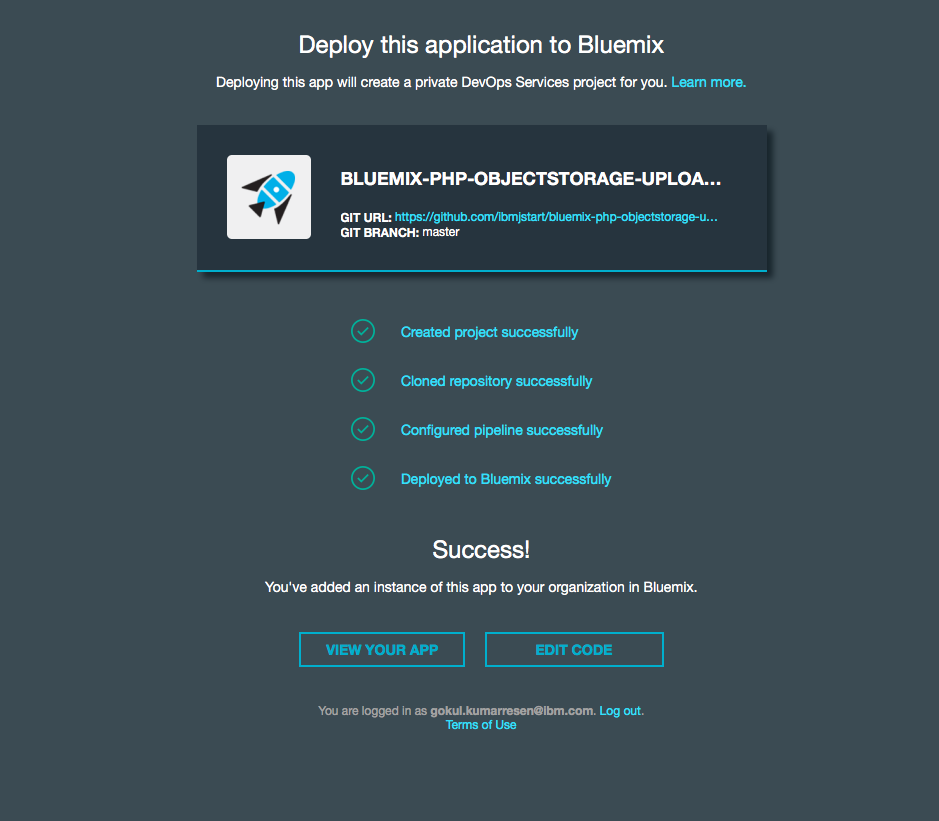

# bluemix-php-objectstorage-uploader

A simple PHP application for demonstrating how to upload and delete files from Object Storage.

## Deployment

We highly recommend using the Deploy to Bluemix button for any users unfamiliar with deploying applications on [Bluemix](https://bluemix.net).

### Option 1:

[](https://bluemix.net/deploy?repository=https://github.com/ibmjstart/bluemix-php-objectstorage-uploader.git)

Once you click on the button above, you will be taken to a page to sign into your Bluemix account so you can deploy your app.
Once your app is live, your page should look like this:




Go ahead and click on "View your app", and enjoy!

### Option 2:

Before we begin, we first need to install the [**Bluemix Command Line Tool**] (http://clis.ng.bluemix.net/ui/home.html) as well as the [**CF Command Line Tool**](https://github.com/cloudfoundry/cli/releases) that will be used to upload and manage your application. If you've previously installed an older version of the cf tool, make sure you are now using cf v6 by passing it the -v flag:

    cf -v

In the terminal, go to the directory of your app and follow these steps:

1. Clone the repo  
	```
	git clone https://github.com/ibmjstart/bluemix-php-objectstorage-uploader

	cd bluemix-php-objectstorage-uploader
	```
2. Modify "host" in [manifest.yml](manifest.yml) to a unique sequence, like this:
	```
	host: <your-unique-username>-bluemix-php-objectstorage-uploader
	```

3. Create the Object Storage service
	```
	cf create-service Object-Storage Free Uploader_Object-Storage
	```

4. Push app
	```
	cf push
	``` 
5. You should get a response similar to that shown below:

		requested state: started
		instances: 1/1
		usage: 128M x 1 instances
		urls: <your-unique-username>-bluemix-php-objectstorage-uploader.mybluemix.net
		last uploaded: Mon Jan 16 21:23:52 UTC 2017
		stack: cflinuxfs2
		buildpack: https://github.com/cloudfoundry/php-buildpack

		     state     since                    cpu    memory         disk         details
		#0   running   2017-01-16 04:25:52 PM   0.0%   1.1M of 128M   1.3M of 1G
		
	Now in order to view your app, copy and paste what comes after the "urls: " tag above into your browser! Enjoy!

> If you need help setting up the Cloudfoundry CLI please refer to the [Bluemix docs](https://console.ng.bluemix.net/docs/starters/install_cli.html)  

Your app should look like this once deployed:


You can upload files to store in Object Storage as demonstrated above.

This sample is provided under the [MIT license](License.txt)
